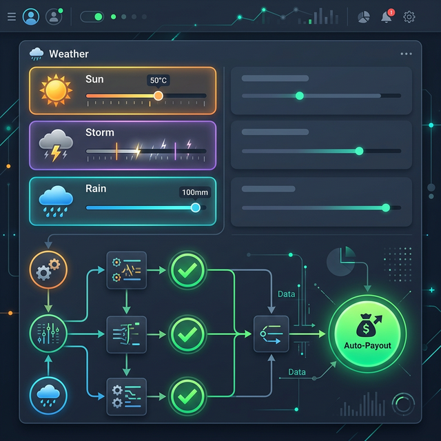

# 🤖 AI-Powered Parametric Insurance Platform for Gig Workers

An **AI-driven parametric insurance platform** designed specifically for gig delivery workers (Zomato, Swiggy, Amazon, etc.). Our system protects workers from **income loss** caused by external disruptions such as floods, heatwaves, or traffic curfews through **instant, automated payouts**.

---

## 🚀 Working Principle: The Parametric Model

Unlike traditional insurance which requires manual verification and lengthy processing, this platform operates on **Parametric Triggers**. 
1. **Define Thresholds**: Admins set weather/disaster thresholds (e.g., Temp > 50°C).
2. **Monitor**: The AI background service continuously polls real-time weather data.
3. **Trigger**: If the threshold is breached in a worker's district, the AI **automatically approves** the claim.
4. **Payout**: Funds are instantly credited to the worker's digital wallet.

---

## 👮 Admin Module (Control & Oversight)

The Admin Module is the "brain" of the platform, where all insurance logic and financial controls reside.

### 🛡️ Key Functionalities:
- **Dynamic Plan Management**: 
  - Create and update insurance plans (Starter, Smart, Pro, Max).
  - Define **AI Triggers** in JSON format (e.g., `{"situation":"Summer","factor":"temperature","threshold":50,"operator":">"}`).
- **Automated Claim Approval**: 
  - Claims matching parametric conditions are approved **instantly** by the AI monitor.
  - No manual intervention is needed for weather-based disasters.
- **Wallet & Fund Management**:
  - Track the central "Insurance Fund" wallet.
  - Monitor all premium inflows and claim outflows.
- **Partner & User Auditing**:
  - Comprehensive dashboard to view all active workers across different platforms.
  - Review manually filed claims (e.g., accidents) with **AI Fraud Risk Scores**.
- **Support System**:
  - Direct communication channel to reply to user queries and push real-time notifications.

---

## 👤 User Module (Gig Worker Dashboard)

A highly responsive, platform-adaptive interface designed for ease of use in the field.

### 🛡️ Key Functionalities:
- **Platform-Adaptive Branding**:
  - The UI automatically restyles itself (colors, logos, banners) to match the user's employer (Zomato, Swiggy, Blinkit, etc.).
- **Smart Subscription**:
  - Purchase weekly insurance plans with AI-calculated dynamic premiums.
  - Access to a **7-day Free Trial** for new users.
- **AI-Powered Claims**:
  - **Auto-Filing**: The AI automatically files and approves claims for disasters it detects in the user's area.
  - **Manual Filing**: Users can file claims for situation not tracked by sensors (e.g., small accidents).
- **Wallet Interface**:
  - Instant credit of claim amounts.
  - Full history of insurance purchases and payouts.
- **Real-Time Notifications**:
  - Get alerted the moment a disaster is detected or a payout is processed.

---

## 🔄 The Complete Application Life-Cycle

This section explains exactly what happens from the moment the application is launched until a claim is settled.

### **1. Launch & System Init**
- **Plan Seeding**: On backend startup, `PlanService` automatically populates the database with 4 core plans (**Starter, Smart, Pro, Max**) and attaches their default **AI Parametric Triggers** (e.g., Heat > 50°C, Rain > 100mm).
- **Service Ready**: The Java REST API, MySQL Database, and Python AI Fraud Engine connect to form a unified ecosystem.

### **2. User Onboarding & Adaptation**
- **Platform Selection**: The user selects their gig employer (e.g., Zomato, Swiggy).
- **Dynamic Theming**: The UI instantly adapts its colors, logos, and banners to match the selected partner's branding.
- **Geo-Tagging**: The user registers with their **State** and **District**, which the AI uses to track local weather disruptions.

### **3. Subscription & AI Protection**
- **Dynamic Pricing**: The AI assesses the local risk and displays the weekly premium.
- **Weekly Policy**: The user purchases a 7-day subscription. The system prevents duplicate policies for the same week.
- **Active Coverage**: The user is now under "AI Protection."

### **4. 24/7 AI Weather Monitoring**
- **Background Pulse**: The `AutoClaimService` runs every hour, scanning every active user's location.
- **Weather API Integration**: It fetches real-time meteorological data (Temperature, Wind, Rainfall, Humidity).
- **Threshold Check**: The AI compares live data against the **Parametric Triggers** set by the Admin in Phase 1.

### **5. Threshold Breach & Auto-Approval**
- **Disaster Detection**: If weather hits a trigger (e.g., Temp = 51.5°C), the AI flags the user.
- **Auto-Filing**: The system automatically creates a claim request.
- **Instant AI Verification**: The `ClaimService` performs a final fraud check and verifies the parametric data match.
- **Auto-Approval**: The claim is approved **instantly** without any manual clicks by users or admins.

### **6. Instant Payout & Reset**
- **Wallet Credit**: Coverage funds (e.g., ₹12,000) move from the **Admin Fund** to the **User Wallet** in milliseconds.
- **Notification**: The worker receives a real-time alert about the payout.
- **Policy Cycle**: The subscription expires after the payout, and the user can renew for the next week.

---

## 🛠️ Technical Stack

- **Frontend**: React.js, Tailwind CSS (Design System), Framer Motion (Animations).
- **Backend**: Java 17, Spring Boot, Spring Security (JWT), Hibernate/JPA.
- **AI Engine**: Python, FastAPI/Flask (Weather analysis, Fraud Detection).
- **Database**: MySQL (Reliable relational data).

---

## 👮 Admin Credentials
- **Email**: `Gigadmin@gmail.com`
- **Password**: `gigadmin@123`

---
*Empowering India's Gig Economy with AI & Automation.*