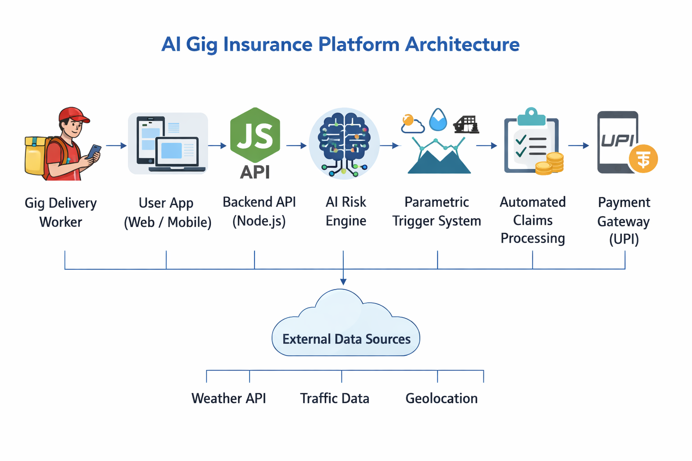
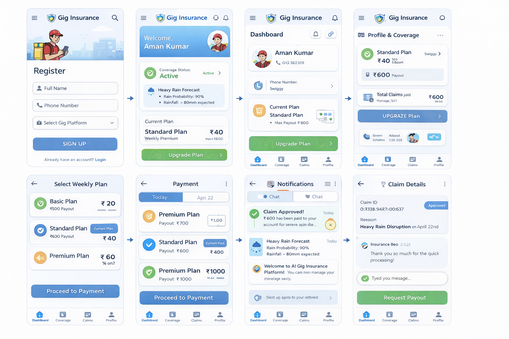

# AI-Powered Parametric Insurance Platform for Gig Workers

An **AI-based parametric insurance platform** designed to protect gig delivery workers from **income loss caused by external disruptions** such as heavy rain, pollution, floods, or curfews.

---

## 1. Problem Statement

Gig delivery workers from platforms like **Zomato, Swiggy, Amazon, Zepto, and Blinkit** depend on daily earnings.
External disruptions such as **extreme weather, pollution, floods, or curfews** can prevent them from working, causing significant income loss.

Currently, there is **no automated insurance system** that compensates workers for these uncontrollable events.

---

## 2. Proposed Solution

We propose an **AI-powered parametric insurance platform** that automatically detects disruptions and provides **instant compensation payouts** to affected gig workers.

The system uses **AI risk prediction and parametric triggers** to automate claims and reduce manual intervention.

---

## 3. Target Users

Gig delivery partners working with:

- Zomato
- Swiggy
- Amazon
- Zepto
- Blinkit

---

## 4. Key Features

- AI-based **risk prediction**
- **Weekly insurance pricing model**
- Automated **parametric claim triggers**
- AI-based **fraud detection**
- **Instant payout simulation**
- Worker **dashboard and notifications**
- **Chat support and claim management**

---

## 5. System Architecture

The architecture of the AI Gig Insurance Platform is shown below.



### Architecture Overview

```
Delivery Worker App
        ↓
Frontend (React)
        ↓
Backend API (Node.js)
        ↓
AI Risk Prediction Engine
        ↓
Parametric Trigger System
        ↓
Claim Automation Engine
        ↓
Payment Gateway (Mock UPI)
```

### Component Responsibilities

**Frontend (React)**
Provides the user interface for gig workers to register, view coverage, select plans, and manage claims.

**Backend API (Node.js)**
Handles authentication, policy management, claims processing, and API integration.

**AI Risk Prediction Engine**
Analyzes weather, traffic, pollution, and historical data to calculate risk and dynamic premiums.

**Parametric Trigger System**
Automatically triggers claims when predefined conditions occur.

**Claim Automation Engine**
Creates claims and initiates payouts automatically.

**Payment Gateway (Mock UPI)**
Simulates instant payouts to the worker’s account.

---

## 6. Application UI

Below are the primary user interface screens for the platform.



### Main Screens

- Worker Registration
- Login
- Worker Dashboard
- Insurance Plan Selection
- Premium Payment
- Notifications
- Chat Support
- Claim Processing

---

## 6.5 Admin Dashboard

An administrator account is built into the system for managing users, plans, payments, and support queries. The default credentials are:

- **Email:** Gigadmin@gmail.com
- **Password:** gigadmin@123

Admins log in via the **same login page** as regular users using their email and password. If the submitted credentials match an admin account, the application redirects to the admin portal instead of the user dashboard.

Once logged in, the admin may:

- View/list and delete users
- Review and reply to user queries
- Adjust plan premiums and details
- View payments and approve pending payouts
- Change the admin email/password under Settings

There is no separate admin registration page; credentials can be updated via the Settings panel after login.

## 7. System Workflow

1. Worker registers on the platform
2. AI calculates the **weekly premium** based on risk factors
3. System continuously monitors **weather, pollution, and traffic data**
4. If a disruption is detected, a **parametric trigger activates**
5. Claim is automatically generated
6. Worker receives **instant payout**

---

## 8. Weekly Pricing Model

| Plan     | Weekly Premium | Max Payout |
| -------- | -------------- | ---------- |
| Basic    | ₹20            | ₹300       |
| Standard | ₹40            | ₹600       |
| Premium  | ₹60            | ₹1000      |

This pricing model aligns with the **weekly earning cycle of gig workers**.

---

## 9. Parametric Triggers

| Disruption | Condition          | Action               |
| ---------- | ------------------ | -------------------- |
| Heavy Rain | Rain > 60mm        | Automatic payout     |
| Flood      | Flood alert issued | Auto claim triggered |
| Pollution  | AQI > 400          | Compensation payout  |
| Curfew     | Zone lockdown      | Income payout        |

---

## 10. Tech Stack

### Frontend

React.js

### Backend

Node.js
Express.js

### Database

MongoDB

### AI / Machine Learning

Python
Scikit-learn

### External APIs

Weather API
Pollution API
Traffic API

---

## 11. AI Integration

AI is used for the following functions:

### Risk Prediction

Predict disruption risk using:

- rainfall
- temperature
- pollution levels
- traffic congestion
- historical disruption data

### Dynamic Premium Calculation

Weekly premiums are dynamically calculated based on predicted risk levels.

### Fraud Detection

AI identifies suspicious claim patterns such as:

- GPS spoofing
- duplicate claims
- abnormal activity patterns

---

## 12. Development Plan

### Phase 1 – Ideation & Architecture

Define system architecture, workflow, and AI integration strategy.

### Phase 2 – Core Platform Development

Build registration, policy management, dynamic premium calculation, and claims automation.

### Phase 3 – Advanced Features

Implement fraud detection, instant payout simulation, and analytics dashboard.

---

## 13. Team Responsibilities

| Role     | Responsibility                    |
| -------- | --------------------------------- |
| Member 1 | Documentation and README          |
| Member 2 | System architecture design        |
| Member 3 | AI model research                 |
| Member 4 | UI wireframes and user experience |
| Member 5 | API integration and backend setup |

---

## 14. Demo Video

A short demo video explaining the idea and architecture will be added here.

```
Demo Video Link: (To be added)
```

---

## 15. Repository Structure

```
ai-gig-insurance-platform
│
├── README.md
├── docs
│   ├── architecture.md
│   └── workflow.md
│
├── frontend
├── backend
├── ai-model
└── assets
    ├── system-architecture.png
    └── ui-wireframe.png
```

---