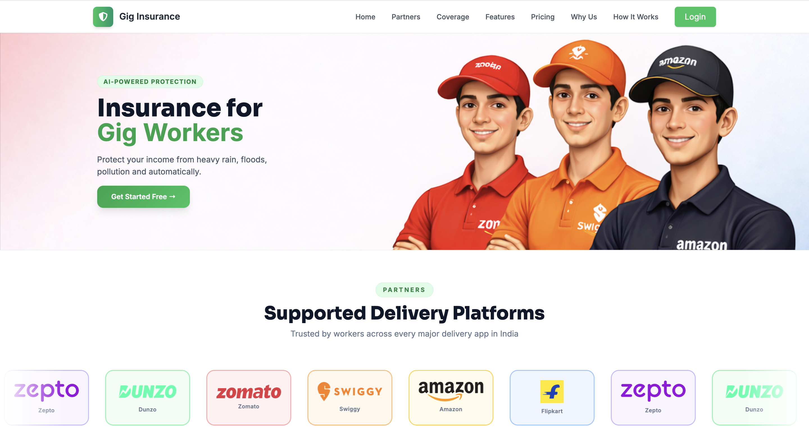
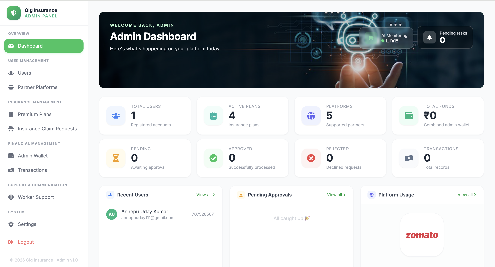
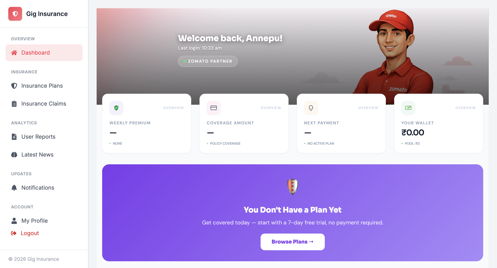
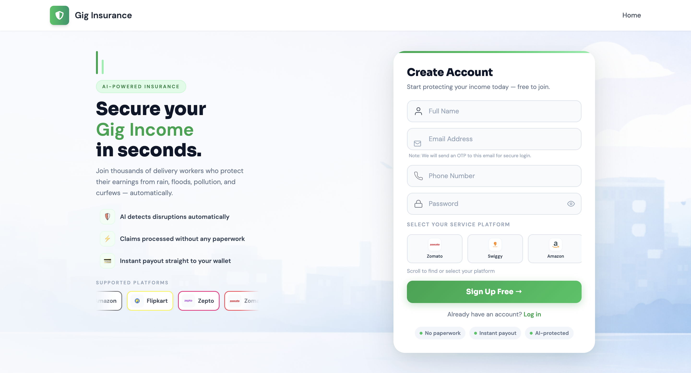
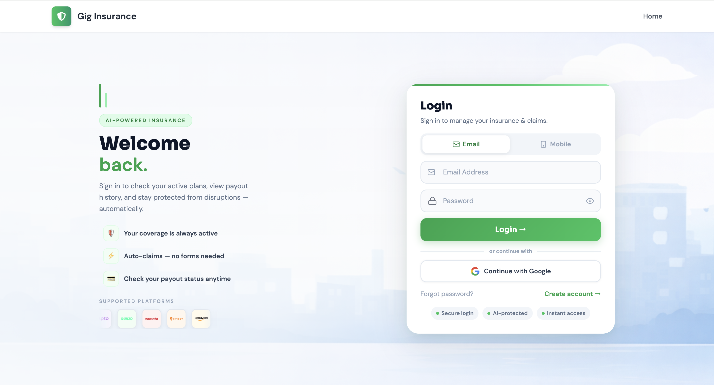

<div align="center">
  
  
  
  <br/><br/>
  
  <h1 style="color: #1a365d;">🛡️ GigShield: AI-Powered Gig Economy Insurance Ecosystem 🛡️</h1>
  
  <p style="color: #2d3748; font-size: 1.25em;"><b>Empowering India's Delivery Partners Through Automated Parametric Finance & Advanced Risk Processing</b></p>
</div>

---

## 🎯 Main Purpose of the Project

**GigShield** is an advanced, automated backend infrastructure specifically engineered to protect India's gig workers (Zomato and Swiggy delivery partners) against uncontrollable income loss caused by environmental and administrative disruptions. 

It uses **AI-driven parametric models** to automatically monitor weather patterns, dynamically compute localized premiums, evaluate fraud risks, and directly disperse financial relief to delivery partners when working conditions become unsafe or impossible — **all entirely autonomously without the worker needing to file a single manual claim.**

---

## 📸 Platform Previews (Output)

Here is exactly what the integrated outputs look like for the administrators and the delivery workers utilizing the platform:

<div align="center">
  <b>1. 🌍 Public Landing Page</b><br>
  <i>(Public-facing portal highlighting all supported gig-delivery platforms like Zomato, Swiggy, and Amazon)</i><br>
  
  <br><br>

  <b>2. 👑 Comprehensive Admin Panel</b><br>
  <i>(Monitors real-time macro metrics, active AI-fraud flagged lists, and global wallet funds)</i><br>
  
  <br><br>

  <b>3. 🛵 Delivery Worker Hub (e.g. Zomato Theming)</b><br>
  <i>(Live wallet balances, active policy coverages, and algorithmic risk assessments dynamically displayed)</i><br>
  
  <br><br>

  <b>4. ⚡ Instant Platform Registration</b><br>
  <i>(Frictionless onboarding capturing precise district coordinates to feed directly into the Python AI pricing models)</i><br>
  
  <br><br>

  <b>5. 🔐 Secure OTP Login Interface</b><br>
  <i>(SMTP-powered dual-factor barrier protecting sensitive financial wallet disbursements)</i><br>
  
</div>

---

## 🛠️ Tools & Technologies Used

We assembled this application using a modern, multi-layered stack designed for enterprise-grade scaling, fault-tolerance, and financial security.

### 💻 Frontend (User Interface)
* **React.js (via Vite):** The primary structural dashboard built for immense blazing-fast speeds and reusable component modularity.
* **Tailwind CSS:** Utilized for creating vivid, platform-adaptive theming (e.g., dynamically swapping UI colors to red for Zomato workers, and orange for Swiggy).
* **Framer Motion:** Delivers smooth, satisfying micro-interaction animations such as wallet credits rolling in and live claim status transitions.

### 🟨 Backend (Core API Layer)
* **Java 17 & Spring Boot 3:** The heavy-lifting RESTful engine orchestrating the entire financial logic ecosystem and routing models.
* **Spring Scheduler:** Handles autonomous 24/7 background cron-jobs like the `AutoClaimService` which polls algorithms every hour automatically.
* **Spring Security & JWT:** Stateless security infrastructure barricading sensitive endpoints alongside JSON Web Tokens to bypass classical session vulnerabilities.

### 💾 Database & Persistence
* **MySQL 8.0:** The absolute source of truth. Maintains strict ACID-compliant transactional integrity specifically over high-risk financial payment ledgers.
* **Hibernate (JPA):** The internal Object-Relational Mapping (ORM) layer effortlessly linking database schema structures directly into Java Entities.

### 🐍 AI & Fraud Detection Engine
* **Python 3.11:** The computational core of our intelligent modeling boundaries.
* **FastAPI:** A high-octane API router deployed strictly to allow the Java backend to exchange data with the Python layer securely and instantly.
* **Scikit-learn / Pandas:** Responsible for executing robust Machine Learning algorithms and risk engines to produce a highly accurate 0-100 `Fraud Score`.

### ☁️ Integrations, SMTP & Payments
* **OpenWeatherMap API:** The critical environmental data stream. Constantly polled to measure atmospheric triggers like local district rainfall depth or maximum severe heat thresholds.
* **JavaMailSender (SMTP Integration):** Secures the environment by dispatching instantaneous Two-Factor One-Time Password (OTP) verification emails directly to workers.
* **Razorpay Simulator API:** The mocked payment architecture processing high-speed premium deduction debits and instantaneous wallet indemnification credits.

---

## 🏗️ The Models: Roles, Functions & Architecture

Our database schema is highly interrelated and strictly constrained to prevent race conditions during money movements.

### 👤 1. `User` Model
* **Core Role:** The central ledger capturing the gig worker's identity, geographic location, and live funds.
* **How It Works:** Tracks vital markers like `platform` (Zomato/Swiggy), specific boundaries (`district`, `mandal`), and acts as the vault holding the user's `walletBalance`. It actively facilitates OTP challenge checks for 2FA.

### 👑 2. `Admin` Model
* **Core Role:** High-clearance supervisor entity ensuring policy stabilization.
* **How It Works:** Admins bypass standard security gates to tweak the system. They adjust parametric threshold limits (e.g., maximum temperature bands) and approve/reject claims that the Python AI flagged as mathematically suspicious. 

### 🛡️ 3. `Plan` Model
* **Core Role:** Blueprint mapping out risk vs. coverage tiers (Starter, Smart, Pro, Max).
* **How It Works:** Holds standard properties like `weeklyPremium` and `coverageAmount`. It acts as the seed which the AI Risk engine manipulates to produce a localized user premium variant.

### 📜 4. `Subscription` Model
* **Core Role:** The active risk-contract securely tying a `User` to a `Plan` for a specific 7-day window.
* **How It Works:** Mitigates platform abuse by enforcing strict chronological validity limits (`startDate` and `endDate`). If a disaster hits naturally, the server strictly references only these active binding contracts.

### 🚨 5. `ClaimRequest` Model
* **Core Role:** Forensic record documenting exactly when and how the system reacted to a disaster.
* **How It Works:** Auto-instantiated during a threshold breach. It embeds the exact reason code (e.g. `RAINFALL_EXCEEDED`), maps the generated `fraudScore`, and determines the payout queue status (`APPROVED` or `FLAGGED`).

### 💸 6. `Payment` Model
* **Core Role:** The immutable financial tracking block representing money in motion.
* **How It Works:** Safely regulates all `CREDIT` and `DEBIT` directives utilizing database level pessimistic locks to protect parallel dual-entry ledger accounting avoiding phantom additions and deductions.

### 🔔 7. `Notification` Model
* **Core Role:** Asynchronous external communication router.
* **How It Works:** Immediately pushes messages advising users of completed transactions or urgent subscription renewals.

---

## 🔄 The Comprehensive Working Flow

This backend operates actively rather than reactively through rigorous background task loops. 

1. **User Onboarding & Micro-Pricing:**
   * Delivery partner opens an account selecting their home district. 
   * The Risk microservice contacts the AI Engine: *"What is the risk severity rating for Chennai during this week?"* 
   * AI interpolates multi-year flood models generating a localized `Risk Multiplier`. The Java API calculates the premium; the User purchases a `Subscription`.

2. **The 24/7 AI Watchdog (Auto-Claim Initialization):**
   * A Spring `@Scheduled` worker job automatically initializes every 60 minutes.
   * It gathers arrays of active subscriptions globally and streams bulk API requests to `OpenWeatherMap`.
   * It logically assesses: *"Did the Rain volume reported in Bengaluru just exceed our 65mm critical line?"* 

3. **Fraud Anomaly Check:**
   * Whenever bounds are broken, the Java Engine instantaneously generates a pending `ClaimRequest`.
   * It pushes the footprint to the Python FastAPI logic which assesses velocity logic, GPS telemetry overlap, and user behavioral claim history.
   * A Risk Score (0-100) is returned. 

4. **Instant Liquidity Generation:**
   * If the rating confirms high-fidelity precision (Fraud Score < 20), a transaction block opens.
   * A `Payment` moves the money strictly to the specific User's `walletBalance`.
   * A `Notification` hits resolving the process: *"Disruption registered. Your GigShield wallet has been credited with ₹1,200."*

---

## 🔐 Comprehensive Deep-Layer Security

We architected an enterprise-level, multi-staged security environment natively immune to conventional interception threats.

* 🛡️ **JWT Stateless Context Framework:**
  The server carries completely *zero state*. Cryptographically signed JSON Web Tokens process authentication payload data reducing server cluster memory waste and nullifying dangerous CSRF (Session-hijacking) hacks entirely.
* 🛡️ **`JwtAuthenticationFilter` Barrier Firewall:**
  Our core file `SecurityConfig.java` guarantees every single incoming REST payload runs a gauntlet before invoking logic variables. The filter ensures tokens hold signature structural validity before injecting credentials into the actual thread memory pool.
* 🛡️ **Military-Grade Hashing Logic:**
  All user identification relies on `BCryptPasswordEncoder`. Cleartext passwords and system inputs undergo intense iterative hashing to completely obscure traces in the database.
* 🛡️ **OTP Cryptographic Injection:**
  Extremely sensitive modifications are barricaded via temporal logic checks where users must complete an OTP check bound by a strict database column timestamp (`otpExpiry`).
* 🛡️ **Role-Based Access Control Filtering (RBAC):**
  Internal mappings differentiate standard UI worker flows dynamically versus Administrative routes. Only bearer tokens injecting the `ROLE_ADMIN` context unlock core administrative tools (`.hasRole("ADMIN")`).
* 🛡️ **Cors Web Fortification:**
  We rigidly enforce wildcard restrictions blocking `Access-Control-Allow-Origin: *` to authenticated streams.

---

## 📂 Complete Project Structure & Modification Guide

If you are a developer looking to understand the codebase or need to modify the internal logic, here is an explicit map of the project structure indicating **exactly where you need to go to make changes**:

```text
ai-gig-insurance-platform/
│
├── 🟨 backend/                       # ➔ Java Spring Boot Core API
│   ├── pom.xml                       # Dependency management (Java)
│   └── src/main/
│       ├── java/com/example/aiinsurance/
│       │   ├── controller/           # API routes (Change here to add new REST endpoints)
│       │   ├── model/                # Database entities (Change here to add new columns to User/Plan)
│       │   ├── repository/           # Database queries (JPA interfaces)
│       │   ├── security/             # Security filters (Modify JwtAuthenticationFilter or SecurityConfig here)
│       │   └── service/              # ➔ Core Business Logic (Modify AutoClaimService scheduler here!)
│       │
│       └── resources/
│           └── application.properties # ➔ 🚨 CRITICAL CHANGE REQUIRED: Update your local MySQL credentials here!
│
├── 🐍 ai-model/                      # ➔ Python AI & Fraud Detection API
│   ├── requirements.txt              # Dependency management (Python)
│   ├── main.py                       # FastAPI entry point (Change to add new Python AI endpoints)
│   └── logic/                        # Scikit-learn Risk Models & Fraud API integrations
│       # ➔ Setup required: You must inject the OWM_API_KEY environment variable to use the weather models.
│
├── 💻 frontend/                      # ➔ React UI Dashboard
│   ├── package.json
│   └── src/
│       ├── components/               # React UI elements
│       └── utils/api.js              # ➔ Setup required: Change Axios base URLs here to point to Prod if deploying.
│
└── 📄 README.md                      # Architecture documentation (You are here!)
```

### 📍 Where exactly do I go to change things?
* **To change Database Credentials:** ➔ Go straight to `backend/src/main/resources/application.properties` and replace the username/password.
* **To configure Email/SMTP (for OTPs):** ➔ Open `backend/src/main/resources/application.properties` and update the `spring.mail.*` attributes with your Gmail App Password.
* **To configure Payments (Razorpay):** ➔ Open `backend/src/main/resources/application.properties` and paste your Razorpay `key_id` and `secret`.
* **To add/modify a Model (like adding a 'License Plate' to User):** ➔ Change `backend/src/main/java/com/example/aiinsurance/model/User.java`.
* **To modify the auto-claim scheduler frequency:** ➔ Adjust the `@Scheduled` tag inside `backend/src/main/java/com/example/aiinsurance/service/AutoClaimService.java`.
* **To tighten or loosen CORS Security:** ➔ Go to `backend/src/main/java/com/example/aiinsurance/security/SecurityConfig.java`.

---

## 💻 Instructions to Run & Launch Project (Pin-by-Pin)

For Users and Reviewers configuring the GigShield Backend instance for deployment or development: Follow these steps accurately.

### ⚙️ Step 1. Base Requirements Installation
Before setting up, ensure your workstation holds the fundamental interpreters.
- [Java Development Kit 17+](https://adoptium.net/temurin/releases/) installed.
- [Python 3.11+](https://www.python.org/downloads/) installed.
- [MySQL Server 8.0+](https://dev.mysql.com/downloads/) installed and operating on port `3306`.

### 🗄️ Step 2. Database, SMTP, & Payment Configuration
**Important Variables to change:** You must allocate the proper structural DB and supply API keys prior to booting the program. 

Open your local MySQL CLI (or client like DBeaver/Workbench):
```sql
CREATE DATABASE gigshield;
```

**Navigate to:** `GigShield/backend/src/main/resources/application.properties`
Modify the configuration rigorously mapping your personal local DB parameters, Email server, and Payment sandbox keys:
```properties
## !! 1. CHANGE THESE DATABASE STRINGS !! ##
spring.datasource.url=jdbc:mysql://localhost:3306/gigshield
spring.datasource.username=YOUR_ACTUAL_MYSQL_USERNAME_HERE
spring.datasource.password=YOUR_ACTUAL_MYSQL_PASSWORD_HERE

## !! 2. CHANGE THESE SMTP (EMAIL) STRINGS !! ##
# (Required if you want the OTP Registration and push notification emails to work)
spring.mail.host=smtp.gmail.com
spring.mail.port=587
spring.mail.username=YOUR_GMAIL_ADDRESS@gmail.com
# Use a 16-digit Google App Password, NOT your regular password!
spring.mail.password=YOUR_GMAIL_APP_PASSWORD

## !! 3. CHANGE THESE PAYMENT STRINGS !! ##
# (Required for simulated Razorpay claim money transfers)
razorpay.api.key=YOUR_RAZORPAY_TEST_KEY_ID
razorpay.api.secret=YOUR_RAZORPAY_TEST_SECRET
```

### 🚀 Step 3. The Ultimate One-Click Startup (`start.sh` / `start.bat`)

You don't need to manually start each service sequentially! We have provided an autonomous orchestration script that handles everything. 

**⚠️ Wait! Before running the script, you must verify your environment:**
1. Open up a terminal and check that these commands return valid versions:
   * `java -version` ➔ (Must be Java 17+)
   * `mvn -v` ➔ (Maven must be accessible in your system PATH)
   * `npm -v` ➔ (Node Package Manager must be installed for the React Frontend)
   * `python --version` or `python3 --version` ➔ (Python must be accessible for the AI Engine)
2. Ensure you have accurately changed the Database Credentials in `application.properties` (as outlined in Step 2).
3. *(Mac/Linux only)* Make sure you grant the script executable permissions: 
   ```bash
   chmod +x start.sh
   ```

**Now, run the orchestration script!**
```bash
# On macOS / Linux terminal
./start.sh

# On Windows (Command Prompt / PowerShell)
start.bat
```

**What exactly happens when you run this script?**
Instead of manually typing build commands, the script does the heavy lifting synchronously:
1. 🧹 **Port Lock Cleanup:** It aggressively searches for and kills any frozen background processes blocking ports `4000`, `8000`, and `5173` to prevent startup collisions.
2. 🤖 **AI Engine Virtualization:** It navigates to `ai-model/`, automatically generates an isolated Python Virtual Environment (`venv`), auto-installs `scikit-learn` & `FastAPI` dependencies quietly, and launches the AI server on **Port 8000**.
3. 🖥️ **Java Spring Compilation:** It enters `backend/`, suppresses messy maven logs, executes a `mvn clean install` to build the `.jar`, generates your MySQL relational tables automatically, and binds the REST API to **Port 4000**.
4. 🌐 **React UI Spinning:** It jumps into `frontend/`, executes a silent `npm install` for node modules, and boots the interactive user GUI to **Port 5173**.
5. ⏳ **Live Health Monitoring:** It continuously pings the health endpoints of all three active services. Once it detects HTTP 200 OK statuses across the board, it outputs the master success checklist!

### 🤝 Step 4. Integration Verification
If successfully orchestrated by the automation script, you can visit the active hubs immediately:
- **Frontend Dashboard:** ➔ `http://localhost:5173`
- **Backend API Layer:** ➔ `http://localhost:4000/api/plans` 
- **AI Fraud Visualizer (Swagger):** ➔ `http://localhost:8000/docs`

> 🛑 **How to Stop?** To shut down the entire GigShield platform, simply press **`Ctrl+C`** exclusively within the terminal running the script. It will intercept the shutdown signal and gracefully terminate all three processes (Java, Python, Node) simultaneously without leaving hanging ports!

---

<h2 align="center">👨‍💻 Lead Developer & Designer</h2>
<p align="center"><i>Engineered and designed with precision for the Indian gig-economy context to solve real-world disruptions.</i></p>

<p align="center">
  <table align="center" width="800">
    <tr>
      <td align="left" width="550" style="padding-left: 20px;">
        <h2>Annepu Uday Kumar</h2>
        <p>📞 <b>Direct Contact:</b> +91 7075285071</p>
        <br/>
        <a href="mailto:annepuuday111@gmail.com">
          
        </a>
        <br/><br/>
        <a href="http://annepuudaykumar.netlify.app/">
          
        </a> 
        <a href="https://www.linkedin.com/in/annepuudaykumar/">
          
        </a>
        <a href="https://github.com/Annepuuday111">
          
        </a>
      </td>
    </tr>
  </table>
</p>

---